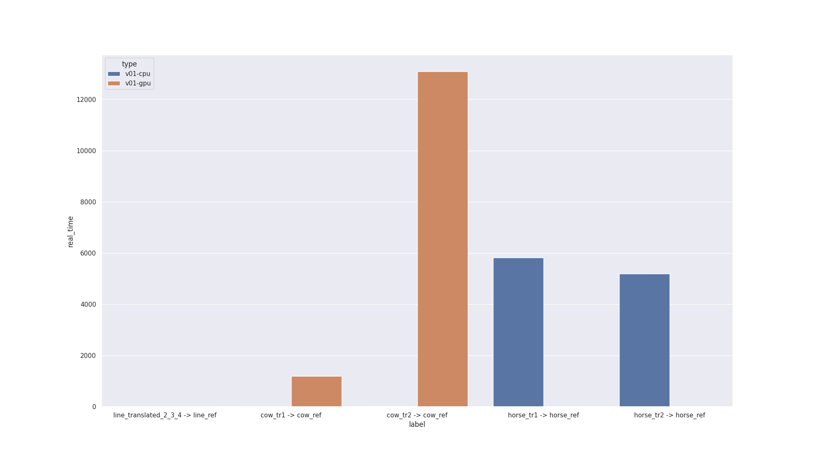

---
title: Who's the fastest ?
author:
- Alex van Vliet
- Théophane Vié
- Paul Khuat-Duy
titlepage: true
...

\newpage

# Introduction

L'Iterative Closest Point (ICP) est un algorithme d'alignement de nuages de points. Il permet de déterminer la transformation entre deux nuages de points représentant un même objet dans deux positions différentes en minimisant de manière itérative la distance entre les points. C'est un algorithme très utilisé en robotique et vision par ordinateur, notamment pour les algorithmes de Simultaneous Localisation And Mapping (SLAM), pour la reconstruction de surfaces et de volumes...

Il existe de nombreuses variantes de l'ICP toutes rencontrant plus ou moins d'étapes en fonction du résultat recherché. Voici les étapes de l'algorithme que nous avons choisi :

- centrage des deux nuages de points,
- détermination des associations (appelé nuage associé) entre les nuages centrés, c'est-à-dire pour chaque point dans le premier nuage de point, détection de son point le plus proche dans le deuxième,
- calcul de la matrice de transformation pour passer du premier nuage centré à son nuage associé en utilisant une décomposition en valeurs singulières de la matrice de covariance,
- application de la matrice au premier nuage.

Ces étapes sont reproduites tant que l'erreur n'est pas suffisament faible, c'est à dire tant que les deux nuages de points ne sont pas superposés, ou qu'un nombre d'itérations maximal n'est pas atteint.

# Première implémentation

## CPU

Notre première implémentation CPU est très simple: c'est une traduction en C++ de l'explication précédente en utilisant un `std::vector` de `Point3D` pour représenter les nuages de points et une classe `Matrix` pour la matrice de transformation. La SVD est faite avec `Eigen`, une bibliothèque d'algèbre linéaire en C++. Une fois cette version basique fonctionnelle, nous avons parallélisé le calcul du point le plus proche, en lançant les recherches sur plusieurs threads, et le centrage des nuages de points en utilisant OpenMP. Une petite amélioration algorithmique a aussi été ajoutée: il suffit de centrer le nuage de points d'arrivée une seule fois puisqu'il ne change pas.

Source : http://www.sci.utah.edu/~shireen/pdfs/tutorials/Elhabian_ICP09.pdf https://github.com/niosus/notebooks/blob/master/icp.ipynb https://www.youtube.com/watch?v=QWDM4cFdKrE

## GPU

Pour la première implémentation GPU, plutôt que de tout réécrire directement, nous avons d'abord essayé une version avec de la mémoire managée (c'est-à-dire partagée entre le CPU et le GPU). L'idée était simple : afin de ne pas réécrire tout le code, il suffisait de changer les allocations et la mémoire managée faisait le reste. Nous pourrions ensuite analyser les performances et passer sur GPU les parties problématique.

Malheureusement, ce n'était pas si facile. Après ce changement, la vitesse était si mauvaise que nous avons supprimé cette version pour recommencer. Apprenant de nos erreurs, nous avons analysé quelles parties pourraient aller sur GPU et à quels moments les transfers de mémoires étaient nécessaires. Nous avons ensuite conclus que toutes les parties itérant sur les points des nuages pourraient bénéficier d'une accélération en étant sur GPU, c'est-à-dire tout sauf la SVD que nous avons gardé sur CPU. Il reste donc trois transferts de mémoires:
- à l'initialisation il faut envoyer les points sur le GPU,
- pour la SVD, mais il s'agit que de deux fois neufs valeurs,
- après la fin de l'algorithme pour récupérer le résultat.

Nous avons donc conclus qu'effectivement la mémoire managée était une mauvaise idée puisqu'il n'était vraiment pas nécessaire d'avoir les informations sur GPU et CPU en même temps.

## Performances

!include v01.md

Après avoir implémenté toutes les parties susmentionnées avec CUDA, cette version restait beaucoup plus lente que notre référence, mais était beaucoup plus simplement analysable, avec un code beaucoup plus propre. On note que la version gpu est environ mille fois plus lentes sur cow et crash sur gpu parce que les kernels prennent trop de temps.

# Indicateurs de performance

## Google Test

Source: https://github.com/google/googletest

Google Test est un framework de tests C++, celui-ci nous a permis de vérifier durant tout le développement de la version CPU que nos fonctions
renvoyaient des résultats cohérents et d'éviter les régressions lors de nos phases de refactos.

## Google Benchmark

Source: https://github.com/google/benchmark

Google Benchmark est l'outil de benchmarking qui a été utilisé pour réaliser tous les benchmarks présents dans ce rapport. Ce framework nous
a permis de tester si nos dernières améliorations impactaient la performance de notre programme autant sur la partie CPU que la partie GPU.

## Flamegraph

Source: https://github.com/jonhoo/inferno

Cet outils de profiling nous a permis de voir sur l'implémentation GPU, les fonctions qui prenaient le plus de temps pour avoir des informations
sur les fonctions a optimiser.

## nvprof

Source: https://docs.nvidia.com/cuda/profiler-users-guide/index.html

Comme flamegraph, cet outils est un profiler mais cette fois-ci pour GPU. De la même façon que flamegraph, il nous permettait de voir le temps
que l'on passait dans chaque fonction mais il nous apportait des informations supplémentaire comme :

- la liste des kernels à optimiser avec un score
- rapport auto-généré sur l'utilisation du GPU pour améliorer nos performances

# Bottlenecks

## Matching the closest point

# GPU improvement

## v2: Ne plus utiliser de ManagedMemory

## v3: Parallélisation  de la moyenne

## v4: Parallélisation du kernel de covariance

## v5: Parallélisation du kernel apply alignment

## v6: Parallélisation du kernel compute error

## v7: Matrices en column-major order

## v8: Ajout d'un VP Tree

## v9:

### v9.1: VP Tree recherche en itératif

### v9.2: Ne plus inclure le centre dans la liste de noeuds

## v10: Ne plus inclure le centre (version récursive)

## V11:

### v11.1: Séparation de la covariance en produit et somme

### v11.2: Somme par block pour le kernel de covariance

## v12: block add mean sum

## v13: Utilisation des warps pour réduire les sommes de blocks (moyenne & covariance)

## v14: Somme par blocks sur les éléments deux à deux (moyenne & covariance)

## v15: Déroulement de boucle pour les sommes de blocks (moyenne & covariance)

# Summary

Pair programming durant tout le projet.
