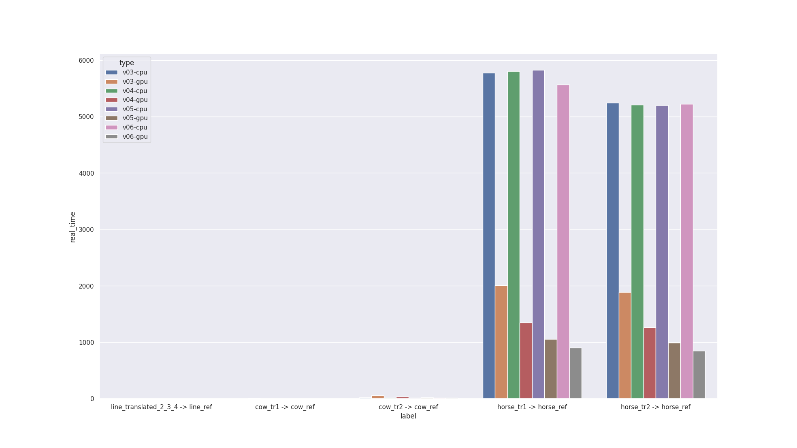
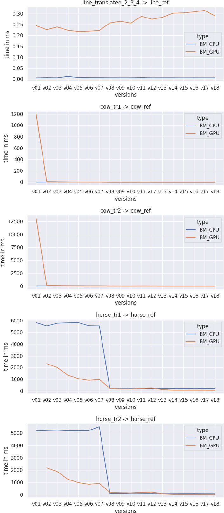
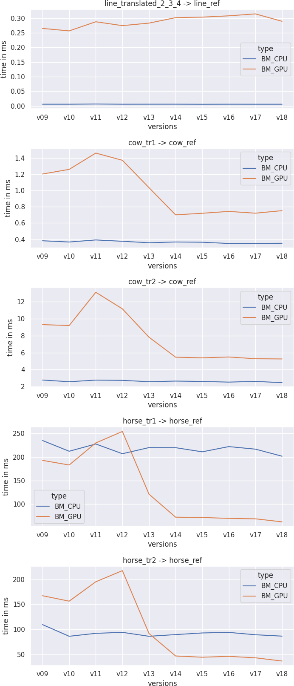

---
title: Who's the fastest ?
author:
- Alex van Vliet
- Théophane Vié
- Paul Khuat-Duy
titlepage: true
lang: fr
header-include: |
    \usepackage{url}
...

\newpage

# Introduction

L'Iterative Closest Point (ICP) est un algorithme d'alignement de nuages de points. Il permet de déterminer la transformation entre deux nuages de points représentant un même objet dans deux positions différentes en minimisant de manière itérative la distance entre les points. C'est un algorithme très utilisé en robotique et vision par ordinateur, notamment pour les algorithmes de Simultaneous Localisation And Mapping (SLAM), pour la reconstruction de surfaces et de volumes...

Il existe de nombreuses variantes de l'ICP toutes rencontrant plus ou moins d'étapes en fonction du résultat recherché. Voici les étapes de l'algorithme que nous avons choisi :

- centrage des deux nuages de points,
- détermination des associations (appelé nuage associé) entre les nuages centrés, c'est-à-dire pour chaque point dans le premier nuage de point, détection de son point le plus proche dans le deuxième,
- calcul de la matrice de transformation pour passer du premier nuage centré à son nuage associé en utilisant une décomposition en valeurs singulières de la matrice de covariance,
- application de la matrice au premier nuage.

Ces étapes sont reproduites tant que l'erreur n'est pas suffisamment faible, c'est à dire tant que les deux nuages de points ne sont pas superposés, ou qu'un nombre d'itérations maximal n'est pas atteint.

# Première implémentation

## CPU

Notre première implémentation CPU est très simple : c'est une traduction en C++ de l'explication précédente en utilisant un `std::vector` de `Point3D` pour représenter les nuages de points et une classe `Matrix` pour la matrice de transformation. La SVD est faite avec `Eigen`, une bibliothèque d'algèbre linéaire en C++. Une fois cette version basique fonctionnelle, nous avons parallélisé le calcul du point le plus proche, et le centrage des nuages de points en lançant les recherches sur plusieurs threads avec OpenMP. Une petite amélioration algorithmique a aussi été ajoutée : il suffit de centrer le nuage de points d'arrivée une seule fois puisqu'il ne change pas.

Sources : \cite{ICPUtah}, \cite{ICPNotebook} and \cite{ICPYouTube}

\newpage

## GPU

Pour la première implémentation GPU, plutôt que de tout réécrire directement, nous avons d'abord essayé une version avec de la mémoire managée (c'est-à-dire partagée entre le CPU et le GPU). L'idée était simple : afin de ne pas réécrire tout le code, il suffisait de changer les allocations et la mémoire managée faisait le reste. Nous pourrions ensuite analyser les performances et passer sur GPU les parties problématiques.

Malheureusement, ce n'était pas si facile. Après ce changement, la vitesse était si mauvaise que nous avons supprimé cette version pour recommencer. Apprenant de nos erreurs, nous avons analysé quelles parties pourraient aller sur GPU et à quels moments les transferts de mémoires étaient nécessaires. Nous avons ensuite conclu que toutes les parties itérant sur les points des nuages pourraient bénéficier d'une accélération en étant sur GPU, c'est-à-dire tout sauf la SVD que nous avons gardé sur CPU. Il reste donc trois transferts de mémoires :
- à l'initialisation il faut envoyer les points sur le GPU,
- pour la SVD, mais il s'agit que de deux fois neuf valeurs,
- après la fin de l'algorithme pour récupérer le résultat.

Nous avons donc conclu qu'effectivement la mémoire managée était une mauvaise idée puisqu'il n'était vraiment pas nécessaire d'avoir les informations sur GPU et CPU en même temps.

Nous avons aussi parallélisé les kernels qui se parallélisaient de manière simple comme le centrage des points.

## Performances

| bench   | label                             |   real_time_cpu |   real_time_gpu |
|---------|-----------------------------------|-----------------|-----------------|
| v01     | line_translated_2_3_4 -> line_ref |      0.00543135 |        0.244931 |
| v01     | cow_tr1 -> cow_ref                |      1.70033    |     1191.24     |
| v01     | cow_tr2 -> cow_ref                |     14.7012     |    13083        |
| v01     | horse_tr1 -> horse_ref            |   5824.46       |      nan        |
| v01     | horse_tr2 -> horse_ref            |   5187.26       |      nan        |

Après avoir implémenté toutes les parties susmentionnées avec CUDA, cette version restait beaucoup plus lente que notre référence, mais était beaucoup plus simplement analysable, avec un code beaucoup plus propre. On note que la version gpu est environ mille fois plus lentes sur cow et crash sur gpu parce que les kernels prennent trop de temps.

# Indicateurs de performance

## Google Test \cite{GTest}

Google Test est un framework de tests C++, celui-ci nous a permis de vérifier durant tout le développement de la version CPU que nos fonctions
renvoyaient des résultats cohérents et d'éviter les régressions lors de nos phases de refactos.

\newpage

## Google Benchmark \cite{GBench}

Google Benchmark est l'outil de benchmarking qui a été utilisé pour réaliser tous les benchmarks présents dans ce rapport. Ce framework nous
a permis de tester si nos dernières améliorations impactaient la performance de notre programme autant sur la partie CPU que la partie GPU.

Pour comparer nos implémentations, nous avons choisi d'utiliser le `real_time` (ou wall clock time). La raison est assez simple, le temps `cpu` a peu de sens ici puisque nous avons plusieurs threads et des calculs sur GPU. Le problème serait le même avec le temps d'exécution des kernels puisqu'il ne prendrait pas en compte le temps d'échange des données.
Afin de stabiliser aussi les résultats, plusieurs itérations sont effectuées et on analyse la moyenne des temps d'exécutions.

## Flamegraph \cite{Flamegraph}

Cet outil de profiling nous a permis de voir sur l'implémentation CPU, les fonctions qui prenaient le plus de temps pour avoir des informations
sur les fonctions a optimiser.

## NVidia Visual Profiler \cite{NVVP}

Comme flamegraph, cet outil est un profiler mais cette fois-ci pour GPU. De la même façon que flamegraph, il nous permettait de voir le temps
que l'on passait dans chaque fonction mais il nous apportait des informations supplémentaire comme :

- la liste des kernels à optimiser avec un score
- une analyse fine de chaque kernel avec des informations comme:
	- le taux d'utilisation de chaque streaming multiprocessor,
	- le taux d'occupation, c'est-à-dire le ratio entre le nombre de warps actifs et le nombre maximum de warps supportés par chaque multiprocessor,
	- ce qui fait ralentir le kernel (dépendances mémoires, synchronisation, dépendances d'instructions...),
	- ...

\newpage

## Méthodologie

Notre méthodologie était la suivante. Dès que nous avons eu notre première version fonctionnelle, nous avons utilisé flamegraph (surtout au début) et nvvprof afin de déterminer quelles étaient les parties de notre code à améliorer ainsi que les modifications à effectuer. C'était donc un procédé itératif :

1. Choix d'une partie à améliorer : en utilisant la durée d'exécution de chaque kernel ainsi que la liste des kernels à optimiser fournie par nvvprof.
2. Recherche de comment améliorer la partie choisie : en utilisant l'analyse fine du kernel.
3. Implémentation de l'amélioration.
4. Benchmark de la nouvelle méthode

### Bottlenecks

Les bottlenecks ont donc été déterminés au fur et à mesure des améliorations. Au départ, les plus gros bottlenecks étaient le calcul des points les plus proches ainsi que le calcul de la covariance. A la fin, les plus gros bottlenecks sont la transmission de données et toujours le calcul des points les plus proches.

\newpage

# Améliorations

## Parallélisation du closest point (v2)

Puisque la recherche du point le plus proche est l'opération qui prend le plus de temps, nous avons décidé de commencer par la paralléliser, c'est-à-dire de lancer toutes les recherches en même temps.

| bench   | label                             |   real_time_cpu (ms) |   real_time_gpu (ms) |
|---------|-----------------------------------|-----------------|-----------------|
| v01     | line_translated_2_3_4 -> line_ref |      0.00543135 |        0.244931 |
| v02     | line_translated_2_3_4 -> line_ref |      0.00645633 |        0.226685 |
| v01     | cow_tr1 -> cow_ref                |      1.70033    |     1191.24     |
| v02     | cow_tr1 -> cow_ref                |      1.9773     |        8.00392  |
| v01     | cow_tr2 -> cow_ref                |     14.7012     |    13083        |
| v02     | cow_tr2 -> cow_ref                |     14.8243     |       74.2754   |
| v01     | horse_tr1 -> horse_ref            |   5824.46       |      nan        |
| v02     | horse_tr1 -> horse_ref            |   5545.64       |     2327.36     |
| v01     | horse_tr2 -> horse_ref            |   5187.26       |      nan        |
| v02     | horse_tr2 -> horse_ref            |   5227.36       |     2182.67     |

Le simple fait de paralléliser cette opération nous a permis d'avoir des performances comparables voire meilleures que sur CPU.

\newpage

## Parallélisation des données non-dépendantes (v3 à v6)

Nous sommes ensuite passés à des fonctions facilement parallélisables. La première amélioration de cette catégorie fût la moyenne. Le nombre de points étant connu, on peut diviser les coordonnées de chaque point en même temps, et ensuite effectuer la somme de ces résultats (v3). La deuxième amélioration fût la parallélisation du calcul de la matrice de covariance: on peut calculer chaque valeur indépendamment des autres (v4). La troisième fût la parallélisation de l'application de la transformation, puisqu'elle s'applique aussi à chaque point séparément (v5). La dernière fût la séparation du calcul de l'erreur entre distance avec le point associé, et somme des distances (v6).

\newpage

## Matrices en column-major order (v7)

Après avoir fait quelques améliorations, nous nous sommes demandé ce que ferait le passage de la matrice des points en column-major, puisqu'il est fréquent pour les bibliothèque GPU d'utiliser ce mode de stockage.

Malheureusement, comme on peut le voir sur le graphique, cela n'apporta pas d'amélioration. La raison étant probablement qu'il aurait fallu repenser tous nos algorithmes.

\newpage

## Ajout d'un VP Tree (v8 à v11)

Un Vantage-Point Tree (vp-tree) est une structure de données qui permet de trouver le plus proche voisin de manière efficace (en `O(log n)`), un peu à la manière d'un octree ou d'un kd-tree, qui fonctionne dans des espaces métriques. La structure est simple : chaque noeud interne contient quatre informations: un centre, un rayon, un fils "intérieur" et un fils "extérieur". Tous les points contenus dans la sphère de centre et de rayon donnés seront donc dans le fils "intérieur" et les autres dans le fils "extérieur". On répète celà récursivement jusqu'à ce qu'on atteigne une certaine capacité : lorsque le nombre de points est inférieur à cette capacité, on les stocke directement dans le noeud.

La construction du vp-tree est assez simple mais pose deux questions : comment choisir le centre et le rayon. Dans beaucoup d'implémentations (\cite{GEMINI}, \cite{VPTreewriteup} and \cite{VPTreedrawings}), le centre est choisi au hasard. Dans d'autres (\cite{VPTreepython}), il est choisi comme étant le plus éloigné du centre parent. Nous avons choisi cette deuxième méthode pour sa simplicité et reproductibilité. Le rayon est lui choisit comme étant la médiane afin d'équilibrer l'arbre et donc d'assurer le `O(log n)` sur la recherche. Nous le construisons d'abord sur CPU et l'envoyons sur GPU.

La recherche est fondamentalement récursive. Disons qu'on recherche le point le plus proche au point `Q`. On calcule `dist(Q, centre)` et on descend dans le fils "intérieur" (respectivement "extérieur") si la distance est plus petite (respectivement plus grande ou égale) au rayon. A la remontée, on a donc trouvé un point `N` le plus proche. Si `dist(Q, N) < |rayon - dist(Q, centre)|`, c'est-à-dire que la distance entre le point recherché et le point trouvé est inférieure à la distance entre le point recherché et le bord de la sphère, alors on a effectivement trouvé le point le plus proche. Sinon il faut aussi descendre dans l'autre fils et renvoyer le fils le plus proche entre les deux descentes.

Notre première implémentation, récursive, augmentait radicalement les performances, mais le closest point restait le ralentisement principal. Nous avons donc essayé 4 versions différentes :

- récursive (v8),
- itérative (v9),
- itérative (v10) mais en retirant le closest point des données à la construction, il faut donc le rajouter lorsqu'on remonte de la recherche,
- récursive (v11), idem.

On remarque sur le graphique qu'en général la v10 est soit aux alentours de la meilleure méthode, soit la meilleure méthode. C'est donc cette version que nous avons choisie.

\newpage

## Optimisation des sommes-réductions (v12 à v18)

Avec cette dernière version, nous nous retrouvons enfin avec nvvprof qui nous recommande d'améliorer d'autres kernels: les sommes qui sont des réductions. Ce sont donc : le calcul de la matrice de covariance, de la moyenne et de l'erreur. La première recommandation était la matrice de covariance. Nous avons donc commencé par séparer la multiplication de la somme puisque cette première peut se faire de manière parallèle (v12). Ensuite, nous avons utilisé du `tiling` afin de pouvoir effectuer les réductions en parallèle (v13), que nous avons ensuite appliqué à la moyenne (v14). Afin d'optimiser la performance de chaque bloc, nous avons utilisé les techniques proposées par NVidia \cite{NVIDIA-OPT}. La première étape fût d'utiliser plusieurs warps par bloc avec du _collaborative loading_ et du _sequential addressing_ pour paralléliser le chargement de mémoire, ainsi qu'éviter les divergences et conflit de banques (v15). La deuxième étape fût de faire la première somme lors du chargement de la mémoire afin de plus utiliser chaque thread (v16). La troisième étape fût de dérouler la boucle lorsque le nombre de threads actifs rentre dans un seul warp, afin de ne plus avoir de condition et de synchronisation (v17). Finalement, nous avons refactorisé tout le code afin de pouvoir faire cette somme par bloc de manière récursive et l'avons appliqué au calcul de l'erreur (v18).

On remarque bien une accélération, d'abord très conséquente, puis plus petite, du temps d'exécution. Il est aussi étonnant de voir que la v12 est plus rapide sur CPU que sur GPU, mais cela s'inverse dès la v13.

\newpage

## Optimisation de la capacité

Après l'implémentation du VP Tree, nous avions choisi arbitrairement une capacité de 8 pour celui-ci,
cela veut dire que lorsque l'on essayait de créer un noeud avec moins de 8 éléments ils étaient tous
stockés dans une liste de points.

Le choix de cette capacité impacte l'arbre résultant, si la capacité choisie est faible, l'arbre
sera plus profond et il y aura plus de noeuds. Au contraire, si cette capacité est élevée, l'arbre
aura une depth très faible voire une depth de 1 si le nombre de points est inférieur à la capacité,
dans ce cas-là, notre structure de donnée ne nous apporte plus aucun avantage comparé à notre première
version avec une recherche dans un vecteur.

Nous avons donc fait des benchmarks pour trouver la capacité nous permettant d'avoir les meilleurs
résultats sur nos différents jeux de tests.

Comme nous pouvons le voir sur le graphe à la page suivante, notre version CPU obtient de bons résultats
sur tous les jeux de tests avec une capacité de 32 alors que la version GPU préfère une capacité plus
élevée à 256. Il semble donc y avoir une "valeure optimale" qui soit différente selon l'implémentation
utilisée.

# Benchmark

## Machine utilisée

La machine utilisée pour nos différents tests durant ce projet est :

 * CPU: Intel i7-9700K (8) @ 4.900GHz
 * GPU: NVIDIA GeForce GTX 1660 SUPER
 * Memory: 32050MiB
 * OS: Manjaro Linux x86_64

## Données des benchmarks

All of the data shown is in milliseconds.

### v01

| bench   | label                             |   real_time_cpu |   real_time_gpu |
|---------|-----------------------------------|-----------------|-----------------|
| v01     | line_translated_2_3_4 -> line_ref |      0.00543135 |        0.244931 |
| v01     | cow_tr1 -> cow_ref                |      1.70033    |     1191.24     |
| v01     | cow_tr2 -> cow_ref                |     14.7012     |    13083        |
| v01     | horse_tr1 -> horse_ref            |   5824.46       |      nan        |
| v01     | horse_tr2 -> horse_ref            |   5187.26       |      nan        |

### v02

| bench   | label                             |   real_time_cpu |   real_time_gpu |
|---------|-----------------------------------|-----------------|-----------------|
| v02     | line_translated_2_3_4 -> line_ref |      0.00645633 |        0.226685 |
| v02     | cow_tr1 -> cow_ref                |      1.9773     |        8.00392  |
| v02     | cow_tr2 -> cow_ref                |     14.8243     |       74.2754   |
| v02     | horse_tr1 -> horse_ref            |   5545.64       |     2327.36     |
| v02     | horse_tr2 -> horse_ref            |   5227.36       |     2182.67     |

### v03

| bench   | label                             |   real_time_cpu |   real_time_gpu |
|---------|-----------------------------------|-----------------|-----------------|
| v03     | line_translated_2_3_4 -> line_ref |       0.0056757 |        0.239157 |
| v03     | cow_tr1 -> cow_ref                |       1.59271   |        5.77385  |
| v03     | cow_tr2 -> cow_ref                |      21.1271    |       60.9313   |
| v03     | horse_tr1 -> horse_ref            |    5776.08      |     2009.74     |
| v03     | horse_tr2 -> horse_ref            |    5244.71      |     1887.13     |

### v04

| bench   | label                             |   real_time_cpu |   real_time_gpu |
|---------|-----------------------------------|-----------------|-----------------|
| v04     | line_translated_2_3_4 -> line_ref |       0.0121319 |        0.224286 |
| v04     | cow_tr1 -> cow_ref                |       1.61068   |        3.31521  |
| v04     | cow_tr2 -> cow_ref                |      14.7851    |       33.8556   |
| v04     | horse_tr1 -> horse_ref            |    5807.14      |     1348.85     |
| v04     | horse_tr2 -> horse_ref            |    5211.41      |     1264.79     |

### v05

| bench   | label                             |   real_time_cpu |   real_time_gpu |
|---------|-----------------------------------|-----------------|-----------------|
| v05     | line_translated_2_3_4 -> line_ref |      0.00698099 |        0.218379 |
| v05     | cow_tr1 -> cow_ref                |      1.5715     |        2.28511  |
| v05     | cow_tr2 -> cow_ref                |     15.8765     |       22.4294   |
| v05     | horse_tr1 -> horse_ref            |   5823.73       |     1058.02     |
| v05     | horse_tr2 -> horse_ref            |   5204.57       |      991.855    |

\newpage

### v06

| bench   | label                             |   real_time_cpu |   real_time_gpu |
|---------|-----------------------------------|-----------------|-----------------|
| v06     | line_translated_2_3_4 -> line_ref |      0.00631902 |        0.219893 |
| v06     | cow_tr1 -> cow_ref                |      1.61704    |        1.75733  |
| v06     | cow_tr2 -> cow_ref                |     16.1609     |       16.6743   |
| v06     | horse_tr1 -> horse_ref            |   5565.68       |      906.397    |
| v06     | horse_tr2 -> horse_ref            |   5219.62       |      849.658    |

### v07

| bench   | label                             |   real_time_cpu |   real_time_gpu |
|---------|-----------------------------------|-----------------|-----------------|
| v07     | line_translated_2_3_4 -> line_ref |      0.00625744 |        0.223278 |
| v07     | cow_tr1 -> cow_ref                |      1.67898    |        1.86757  |
| v07     | cow_tr2 -> cow_ref                |     14.7115     |       17.8203   |
| v07     | horse_tr1 -> horse_ref            |   5549.03       |      984.052    |
| v07     | horse_tr2 -> horse_ref            |   5523.11       |      922.565    |

### v08

| bench   | label                             |   real_time_cpu |   threshold_cpu |   real_time_gpu |   threshold_gpu |
|---------|-----------------------------------|-----------------|-----------------|-----------------|-----------------|
| v08     | line_translated_2_3_4 -> line_ref |      0.00594303 |             128 |        0.257229 |              16 |
| v08     | cow_tr1 -> cow_ref                |      0.374234   |             256 |        1.3343   |            1024 |
| v08     | cow_tr2 -> cow_ref                |      2.83633    |              64 |       12.8413   |             512 |
| v08     | horse_tr1 -> horse_ref            |    225.924      |              32 |      235.663    |             512 |
| v08     | horse_tr2 -> horse_ref            |    110.449      |              32 |      195.86     |             256 |

\newpage

### v09

| bench   | label                             |   real_time_cpu |   threshold_cpu |   real_time_gpu |   threshold_gpu |
|---------|-----------------------------------|-----------------|-----------------|-----------------|-----------------|
| v09     | line_translated_2_3_4 -> line_ref |      0.00584418 |             128 |        0.264938 |              16 |
| v09     | cow_tr1 -> cow_ref                |      0.381556   |             128 |        1.20277  |             512 |
| v09     | cow_tr2 -> cow_ref                |      2.76391    |              32 |        9.30332  |             512 |
| v09     | horse_tr1 -> horse_ref            |    235.099      |              32 |      192.956    |             256 |
| v09     | horse_tr2 -> horse_ref            |    109.676      |              32 |      167.298    |             512 |

### v10

| bench   | label                             |   real_time_cpu |   threshold_cpu |   real_time_gpu |   threshold_gpu |
|---------|-----------------------------------|-----------------|-----------------|-----------------|-----------------|
| v10     | line_translated_2_3_4 -> line_ref |      0.00583085 |             128 |        0.256499 |              16 |
| v10     | cow_tr1 -> cow_ref                |      0.36642    |             128 |        1.25973  |            1024 |
| v10     | cow_tr2 -> cow_ref                |      2.56471    |              32 |        9.193    |             512 |
| v10     | horse_tr1 -> horse_ref            |    212.333      |              32 |      183.131    |             512 |
| v10     | horse_tr2 -> horse_ref            |     86.4337     |              32 |      156.419    |             256 |

### v11

| bench   | label                             |   real_time_cpu |   threshold_cpu |   real_time_gpu |   threshold_gpu |
|---------|-----------------------------------|-----------------|-----------------|-----------------|-----------------|
| v11     | line_translated_2_3_4 -> line_ref |      0.00652639 |            1024 |         0.28771 |              16 |
| v11     | cow_tr1 -> cow_ref                |      0.391568   |             128 |         1.46013 |            1024 |
| v11     | cow_tr2 -> cow_ref                |      2.7548     |              32 |        13.1194  |             128 |
| v11     | horse_tr1 -> horse_ref            |    227.781      |              16 |       229.982   |             256 |
| v11     | horse_tr2 -> horse_ref            |     92.2778     |              32 |       195.053   |             128 |

\newpage

### v12

| bench   | label                             |   real_time_cpu |   threshold_cpu |   real_time_gpu |   threshold_gpu |
|---------|-----------------------------------|-----------------|-----------------|-----------------|-----------------|
| v12     | line_translated_2_3_4 -> line_ref |      0.00583577 |              32 |        0.274496 |              16 |
| v12     | cow_tr1 -> cow_ref                |      0.375193   |             256 |        1.37154  |             512 |
| v12     | cow_tr2 -> cow_ref                |      2.72459    |              32 |       11.1644   |             512 |
| v12     | horse_tr1 -> horse_ref            |    207.097      |              32 |      254.35     |             512 |
| v12     | horse_tr2 -> horse_ref            |     94.2853     |              64 |      217.279    |             256 |

### v13

| bench   | label                             |   real_time_cpu |   threshold_cpu |   real_time_gpu |   threshold_gpu |
|---------|-----------------------------------|-----------------|-----------------|-----------------|-----------------|
| v13     | line_translated_2_3_4 -> line_ref |      0.00590876 |             128 |        0.283086 |              16 |
| v13     | cow_tr1 -> cow_ref                |      0.357313   |             256 |        1.03466  |             512 |
| v13     | cow_tr2 -> cow_ref                |      2.56754    |              32 |        7.81694  |             128 |
| v13     | horse_tr1 -> horse_ref            |    220.099      |              16 |      121.239    |             256 |
| v13     | horse_tr2 -> horse_ref            |     86.4063     |              32 |       91.999    |             256 |

### v14

| bench   | label                             |   real_time_cpu |   threshold_cpu |   real_time_gpu |   threshold_gpu |
|---------|-----------------------------------|-----------------|-----------------|-----------------|-----------------|
| v14     | line_translated_2_3_4 -> line_ref |      0.00594377 |             512 |        0.30175  |              16 |
| v14     | cow_tr1 -> cow_ref                |      0.36655    |             128 |        0.700278 |            1024 |
| v14     | cow_tr2 -> cow_ref                |      2.63942    |              64 |        5.46073  |             256 |
| v14     | horse_tr1 -> horse_ref            |    219.918      |              32 |       72.3843   |             512 |
| v14     | horse_tr2 -> horse_ref            |     89.7858     |              32 |       47.1585   |             256 |

\newpage

### v15

| bench   | label                             |   real_time_cpu |   threshold_cpu |   real_time_gpu |   threshold_gpu |
|---------|-----------------------------------|-----------------|-----------------|-----------------|-----------------|
| v15     | line_translated_2_3_4 -> line_ref |      0.00565556 |              64 |         0.30356 |              16 |
| v15     | cow_tr1 -> cow_ref                |      0.363555   |             128 |         0.71981 |            1024 |
| v15     | cow_tr2 -> cow_ref                |      2.59607    |              64 |         5.38381 |             128 |
| v15     | horse_tr1 -> horse_ref            |    211.115      |              32 |        71.7213  |             512 |
| v15     | horse_tr2 -> horse_ref            |     93.0576     |              32 |        44.6898  |             256 |

### v16

| bench   | label                             |   real_time_cpu |   threshold_cpu |   real_time_gpu |   threshold_gpu |
|---------|-----------------------------------|-----------------|-----------------|-----------------|-----------------|
| v16     | line_translated_2_3_4 -> line_ref |      0.00586017 |             128 |        0.307977 |              16 |
| v16     | cow_tr1 -> cow_ref                |      0.348388   |             128 |        0.74265  |            1024 |
| v16     | cow_tr2 -> cow_ref                |      2.51961    |              32 |        5.48417  |             128 |
| v16     | horse_tr1 -> horse_ref            |    222.211      |              32 |       69.7924   |             512 |
| v16     | horse_tr2 -> horse_ref            |     94.1705     |              32 |       46.3948   |             256 |

### v17

| bench   | label                             |   real_time_cpu |   threshold_cpu |   real_time_gpu |   threshold_gpu |
|---------|-----------------------------------|-----------------|-----------------|-----------------|-----------------|
| v17     | line_translated_2_3_4 -> line_ref |      0.00577102 |              64 |        0.3146   |              16 |
| v17     | cow_tr1 -> cow_ref                |      0.349541   |             128 |        0.720859 |             512 |
| v17     | cow_tr2 -> cow_ref                |      2.60402    |              64 |        5.27588  |             128 |
| v17     | horse_tr1 -> horse_ref            |    216.791      |              32 |       68.8837   |             256 |
| v17     | horse_tr2 -> horse_ref            |     89.4675     |              32 |       43.5039   |             256 |

\newpage

### v18

| bench   | label                             |   real_time_cpu |   threshold_cpu |   real_time_gpu |   threshold_gpu |
|---------|-----------------------------------|-----------------|-----------------|-----------------|-----------------|
| v18     | line_translated_2_3_4 -> line_ref |       0.0057819 |             512 |        0.289298 |              16 |
| v18     | cow_tr1 -> cow_ref                |       0.350881  |             256 |        0.751851 |            1024 |
| v18     | cow_tr2 -> cow_ref                |       2.45497   |              64 |        5.25223  |             128 |
| v18     | horse_tr1 -> horse_ref            |     201.83      |              32 |       62.4554   |             512 |
| v18     | horse_tr2 -> horse_ref            |      86.7328    |              32 |       37.0821   |             256 |

## Évolution des performances au cours des versions

\newpage

\newpage

# Conclusion

Durant tout le déroulement du projet, notre but était d'optimiser les plus gros jeux de donnés disponibles, c'est à dire les tests sur `horse`.

TODO: continuer le disclaimer sur le fait qu'on puisse perdre en perfs sur les exemples simples,
mais j'ai plus d'idées

Nous avons travaillé en pair programming durant tout le projet.

\newpage

\begin{thebibliography}{9}

\bibitem{ICPUtah}
Shireen Elhabian, Amal Farage, Aly Farag
\textit{A Tutorial on Rigit Registration}.
\url{http://www.sci.utah.edu/~shireen/pdfs/tutorials/Elhabian_ICP09.pdf}

\bibitem{ICPNotebook}
niosus
\textit{Notebook all about ICP and it's different implementations}
\url{https://github.com/niosus/notebooks/blob/master/icp.ipynb}

\bibitem{ICPYouTube}
Cyrill Stackniss
\textit{Iterative Closest Point (ICP) - 5 Minutes with Cyrill}
\url{https://www.youtube.com/watch?v=QWDM4cFdKrE}

\bibitem{GTest}
\url{https://github.com/google/googletest}

\bibitem{GBench}
\url{https://github.com/google/benchmark}

\bibitem{Flamegraph}
\url{https://github.com/jonhoo/inferno}

\bibitem{NVVP}
\url{https://docs.nvidia.com/cuda/profiler-users-guide/index.html}

\bibitem{GEMINI}
Timothy DeFreitas, Hachem Saddiki, and Patrick Flaherty
\textit{GEMINI: a computationally-efficient search engine for large gene expression datasets}
\url{https://www.ncbi.nlm.nih.gov/pmc/articles/PMC4765211}

\bibitem{VPTreewriteup}
fribbels
\textit{Vantage Point Trees}
\url{https://fribbels.github.io/vptree/writeup}

\bibitem{VPTreedrawings}
Steve Hanov
\textit{VP Trees: A data structure for finding stuff fast}
\url{http://stevehanov.ca/blog/?id=130}

\bibitem{VPTreepython}
Rickard Sjögren
\textit{VP-Tree in python}
\url{https://github.com/RickardSjogren/vptree}

\bibitem{NVIDIA-OPR}
Mark Harris
\textit{Optimizing Parallel Reduction in CUDA}
\url{https://developer.download.nvidia.com/assets/cuda/files/reduction.pdf}

\end{thebibliography}
